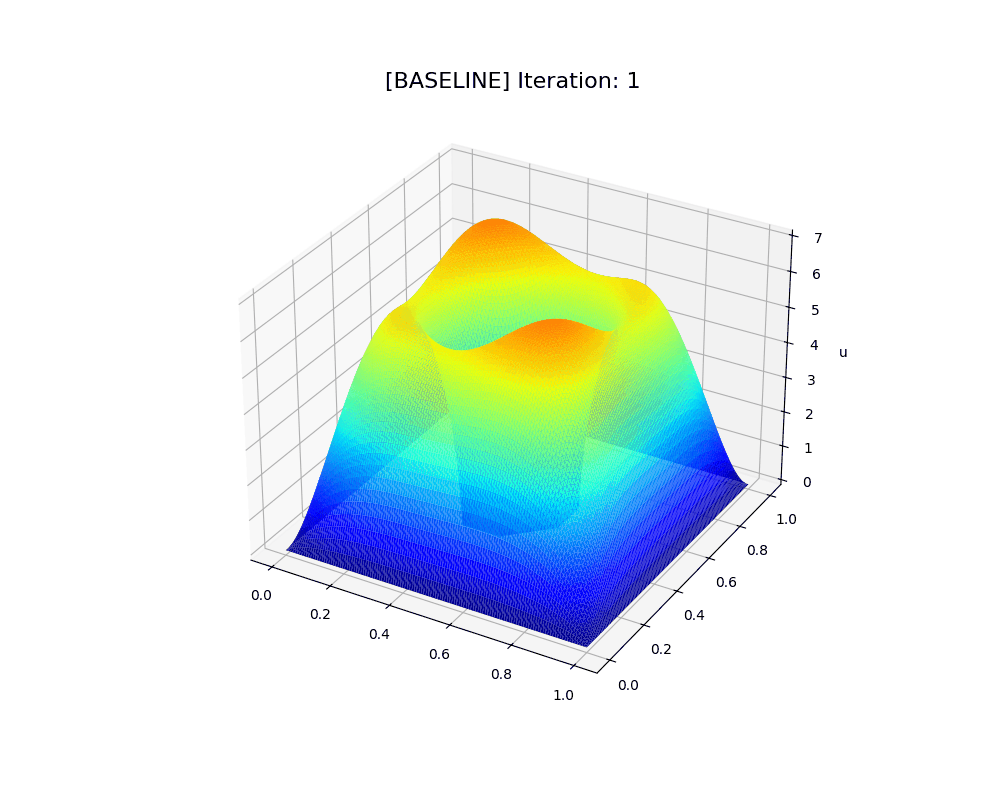
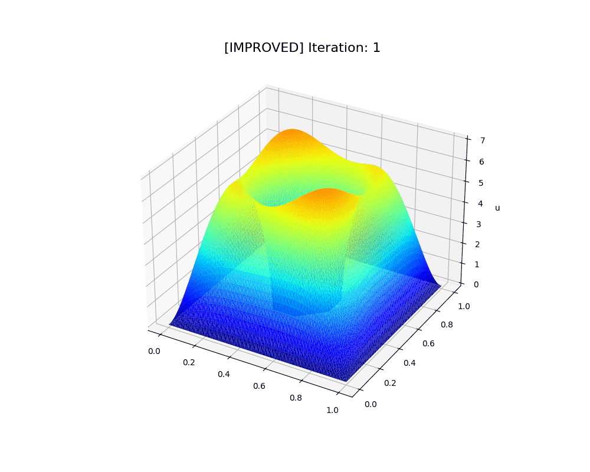
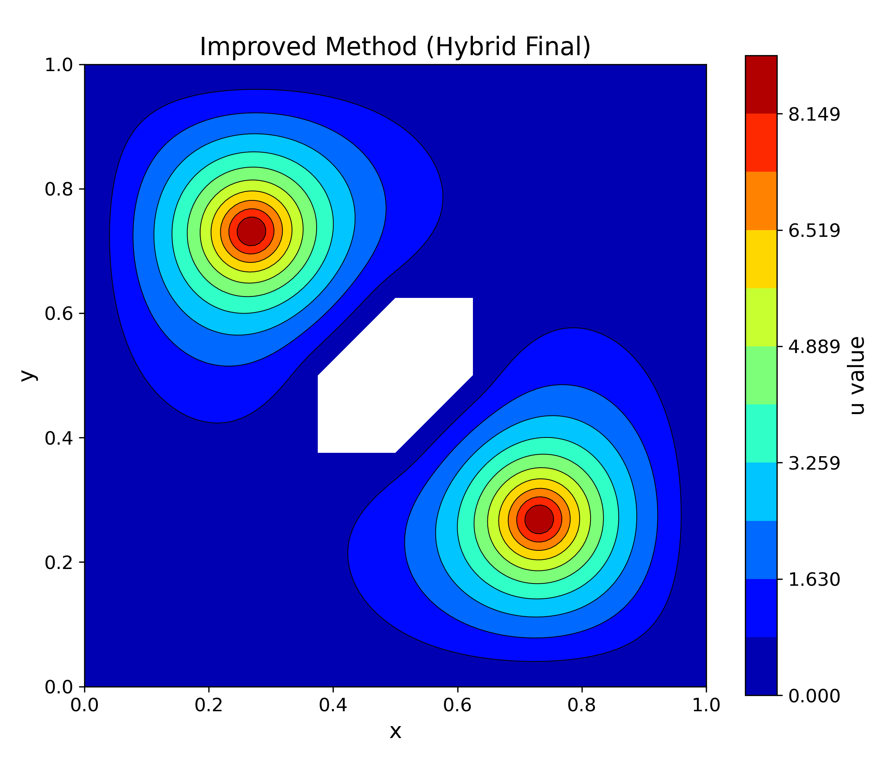

# Numerical Solver for Semilinear Elliptic PDEs

名古屋大学 工学部での卒業研究（非線形偏微分方程式の数値解析）で使用したシミュレーションコードの一部を、技術ポートフォリオとして公開したものです。

六角形の穴が開いた正方形領域において、非線形項を含む楕円型方程式の解を有限要素法（FEM）を用いて求めています。

## ⚠️ Note on Code Quality
本リポジトリのコードは、学部時代の研究用コードをデモンストレーション用に急遽リファクタリングしたものです。
動作確認および数値計算の正当性は検証済みですが、一部に研究試行錯誤時の未使用な変数や、最適化されていない記述が残っている場合があります。あらかじめご了承ください。

## 🧬 Simulation Demo

本プロジェクトでは、収束性と計算速度のトレードオフを解決するために、異なる2つのアルゴリズムを実装・比較しました。

| Baseline: Scaling Method | **Improved: Hybrid Method (Scaling + Newton)** |
| :---: | :---: |
|  |  |
| 安定だが収束が遅い | **初期値を推定後にNewton法へ切り替え (高速)** |
| 収束まで: **約200回** | 収束まで: **約20回** |

> ※ 上記GIFは、計算過程における解 $u$ の形状変化を可視化したものです。

## 🧪 Algorithms

対象：非線形楕円型偏微分方程式（Semilinear Elliptic PDE） $-\Delta u = f(u)$

### 1. Baseline: Scaling Method (`baseline_solver.edp`)
非線形項の制約を満たすように、射影（Scaling）を繰り返して解を探索する手法。
* **特徴:** 初期値依存性が低く、大域的な収束が得られやすい。
* **課題:** 収束次数が1次であり、解に近づいてからの収束が非常に遅い。

### 2. Improved: Hybrid Method (`improved_solver.edp`)
Baselineの手法と、収束の速いNewton法を組み合わせたハイブリッド手法。
1.  **Phase 1:** Scaling法で最初の10回だけ計算し、大まかな解の近似を得る（Global Search）。
2.  **Phase 2:** その近似解を初期値として、Newton法に切り替える（Local Search）。
* **結果:** Newton法の「初期値に敏感」という欠点を克服しつつ、**2次収束による劇的な高速化**を実現しました。

## 📊 Result (Static Plot)

最終的な定常解の2Dプロットです。穴のある領域上で、境界条件を満たす解が得られています。



## 🛠️ Usage

### Requirements
* **FreeFEM++** (Numerical Solver)
* **Python 3.x**
    * `pandas`
    * `matplotlib`
    * `numpy`

### How to Run

1.  **Run Solver (FreeFEM)**
    ```bash
    # Baseline method
    FreeFem++ baseline_solver.edp
    
    # Improved method
    FreeFem++ improved_solver.edp
    ```
    Calculation results (csv files) will be generated in `./results_baseline/` and `./results_improved/`.

2.  **Generate Visualization (Python)**
    ```bash
    # Create GIF animations
    python create_gif_animation.py
    
    # Create static 2D plots
    python plot_thesis_2d.py
    ```

## 👤 Author
**Yu Aoshima**
Graduate School of Engineering, Nagoya University
Department of Applied Physics (Mathematical Engineering)
